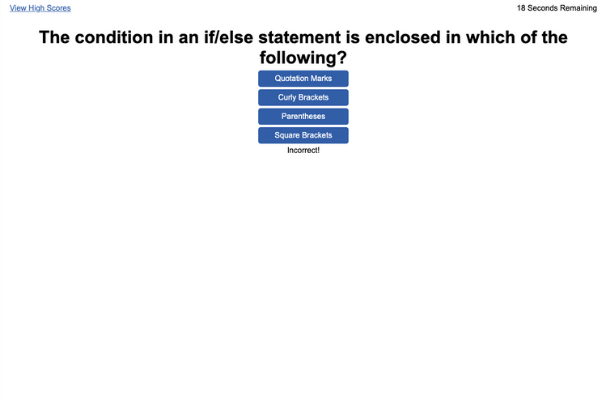
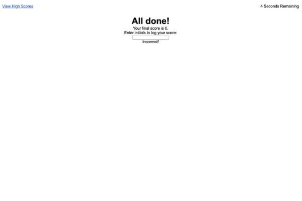
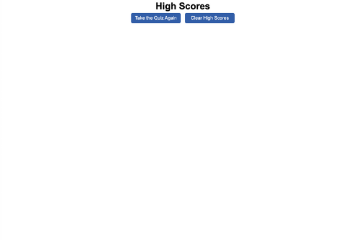

# JavaScript Code Quiz

## Description
This is a brief quiz designed to test the knowledge of the user about JavaScript.

This project is not complete. Even after going to office hours and meeting with a tutor, I didn't have time to complete it to my satisfaction and stay on track within the course. I decided to submit what I have.

I was very excited and still am pleased that I was able to get the questions to appear on the page after a mouse click. That's about where the functionality of this quiz ends.

There are several pieces still missing from this quiz. The script.js isn't able to tell which answer in the first question is the correct answer. The remaining questions don't have any correct or incorrect answers labeled. The "Incorrect!" that appears at the bottom of the page is from the first question.

Every time the mouse is clicked, 10 seconds are deducted from the time remaining. And in an effort to make sure that the time wouldn't go negative, I seem to have mixed up the score that gets logged on the final page. So right now, everyone gets 0.

The input box for the initials isn't connected to the High Scores page. I didn't get to coding that at all.

The code that I wrote for this project is very repetitive. My tutor reminded me about the DRY method, and we talked about using an array. I started to code an array to use, but I couldn't figure out how to get the items from the array to print to the screen. 

In the future, if I'm going to use this project in a portfolio, I need to clean up the code and use an array to cycle through the questions/answer options on the screen. 

## Installation
In order to access this repository, the user needs to clone it from GitHub using the command git clone git@github.com:kaylab78/javascript-code-quiz.git in their command line interface.

## Usage
As it is, when the user clicks on the "Start Quiz" button, the first question appears. 

When the user clicks on any of the answer options, their score is deducted by 10 and the alert on the page says "Incorrect!". This is incorrect functionality. The user expects that when they click on the correct answer, they will be taken to the next question with no time deductions. 

After the last question of the quiz or when the timer runs to 0, the user is taken to a final screen. Their score is displayed, and they have a text box where they can enter their initials to log their score. There should be a button where they can submit their initials and score to be logged onto the high score page. This page can be viewed via the link in the top left corner. 

The page itself would ideally be logging and sorting all of the quiz scores so that the user can see how they rate against their peers. The user can retake the quiz by clicking the button that says, "Take the Quiz Again," or they can clear all of the scores by clicking the button that says, "Clear High Scores."

## Credits
Thank you to the class TA's and the boot camp tutor Meg Meyers for their efforts in trying to help me understand how to combine HTML, CSS and JavaScript into one project. I look forward to continuing to learn these skills in this course.
The wording for the license on this project is from the MIT License outlined [here](https://choosealicense.com/licenses/mit/).

## License
Copyright (c) 2022 Kayla Backus

Permission is hereby granted, free of charge, to any person obtaining a copy of this software and associated documentation files (the "Software"), to deal in the Software without restriction, including without limitation the rights to use, copy, modify, merge, publish, distribute, sublicense, and/or sell copies of the Software, and to permit persons to whom the Software is furnished to do so, subject to the following conditions:

The above copyright notice and this permission notice shall be included in all copies or substantial portions of the Software.

THE SOFTWARE IS PROVIDED "AS IS", WITHOUT WARRANTY OF ANY KIND, EXPRESS OR IMPLIED, INCLUDING BUT NOT LIMITED TO THE WARRANTIES OF MERCHANTABILITY, FITNESS FOR A PARTICULAR PURPOSE AND NONINFRINGEMENT. IN NO EVENT SHALL THE AUTHORS OR COPYRIGHT HOLDERS BE LIABLE FOR ANY CLAIM, DAMAGES OR OTHER LIABILITY, WHETHER IN AN ACTION OF CONTRACT, TORT OR OTHERWISE, ARISING FROM, OUT OF OR IN CONNECTION WITH THE SOFTWARE OR THE USE OR OTHER DEALINGS IN THE SOFTWARE.