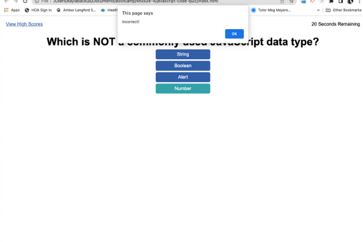
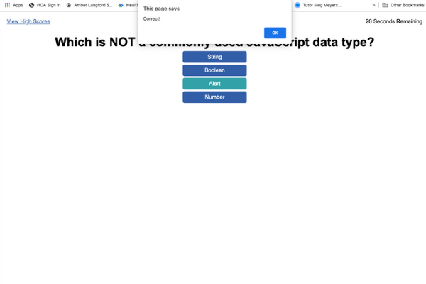
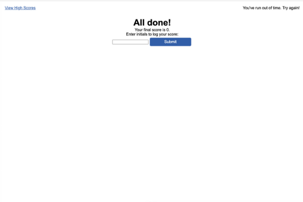

# JavaScript Code Quiz

## Description
This is a brief quiz designed to test the knowledge of the user about JavaScript.

This project is not complete. Even after going to office hours, meeting with a tutor, and talking to her outside of our one hour session, I didn't have time to complete it to my satisfaction *and* stay on track within the course. I decided to submit what I have.

I was very excited and still am pleased that I was able to get the questions to appear on the page after a mouse click. My boot camp tutor Meg Meyers helped me with making sure that the computer could tell which answer was correct or incorrect. That's about where the functionality of this quiz ends.

There is a glitch in the second question. An "incorrect" alert appears every time the user clicks an answer regardless of if it's correct or not. But then, a second alert appears saying if the answer they picked is correct or not.

There are several pieces still missing from this quiz. One example is that the input box for initials isn't saving to localStorage, and therefore, the High Scores page isn't pulling in any information. 

The code that I wrote for this project is very repetitive. (That's why it's only two questions long.) My tutor reminded me about the DRY method, and we talked about using an array. I started to code an array to use, but I couldn't figure out how to get the items from the array to print to the screen. 

In the future, if I'm going to use this project in a portfolio, I need to clean up the code and use an array to cycle through the question/answer options on the screen. 

Plus, I need to get the score and initials to save to localStorage and then print on the High Scores page.

## Installation
In order to access this repository, the user needs to clone it from GitHub using the command git clone git@github.com:kaylab78/javascript-code-quiz.git in their command line interface.

## Usage
As it is, when the user clicks on the "Start Quiz" button, the first question appears. 

When the user clicks on an incorrect answer, their score is deducted by 10 and the alert on the page says "Incorrect!"

When the user clicks on a correct answer, an alert appears on the page saying, "Correct!" No time is deducted.

The second question of the quiz has an incorrect functionality that will need to be corrected in the future. When the user clicks on one of the choices, they receive two alerts. The user expects the second question to act like the first question.

After the last question of the quiz or when the timer runs to 0, the user is taken to a final screen. Their score is displayed, and they have a text box where they can enter their initials to log their score. There is a button that would be used to submit their initials and score to be logged onto the high score page. This button is not currently working. The high score page can be viewed via the link in the top left corner. 

The high score page itself would ideally be logging and sorting all of the quiz scores so that the user can see how they rate against their peers. The user can retake the quiz by clicking the button that says, "Take the Quiz Again," or if it were working properly, they would be able to clear all of the scores by clicking the button that says, "Clear High Scores."

## Credits
Thank you to boot camp tutor Meg Meyers for heavily assisting me with figuring out how to make sure that the computer checks each quiz question against the correct question. 

The wording for the license on this project is from the MIT License outlined [here](https://choosealicense.com/licenses/mit/).

## License
Copyright (c) 2022 Kayla Backus

Permission is hereby granted, free of charge, to any person obtaining a copy of this software and associated documentation files (the "Software"), to deal in the Software without restriction, including without limitation the rights to use, copy, modify, merge, publish, distribute, sublicense, and/or sell copies of the Software, and to permit persons to whom the Software is furnished to do so, subject to the following conditions:

The above copyright notice and this permission notice shall be included in all copies or substantial portions of the Software.

THE SOFTWARE IS PROVIDED "AS IS", WITHOUT WARRANTY OF ANY KIND, EXPRESS OR IMPLIED, INCLUDING BUT NOT LIMITED TO THE WARRANTIES OF MERCHANTABILITY, FITNESS FOR A PARTICULAR PURPOSE AND NONINFRINGEMENT. IN NO EVENT SHALL THE AUTHORS OR COPYRIGHT HOLDERS BE LIABLE FOR ANY CLAIM, DAMAGES OR OTHER LIABILITY, WHETHER IN AN ACTION OF CONTRACT, TORT OR OTHERWISE, ARISING FROM, OUT OF OR IN CONNECTION WITH THE SOFTWARE OR THE USE OR OTHER DEALINGS IN THE SOFTWARE.